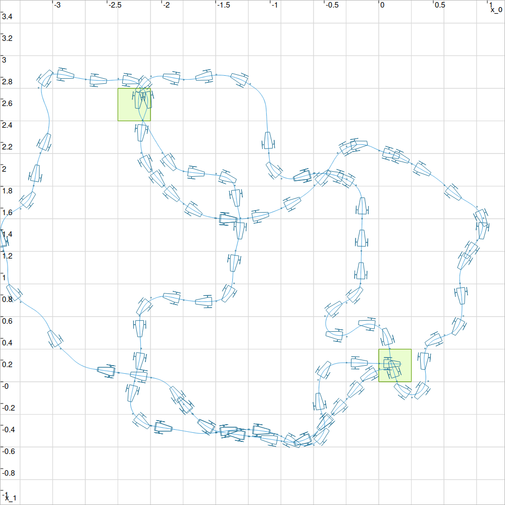
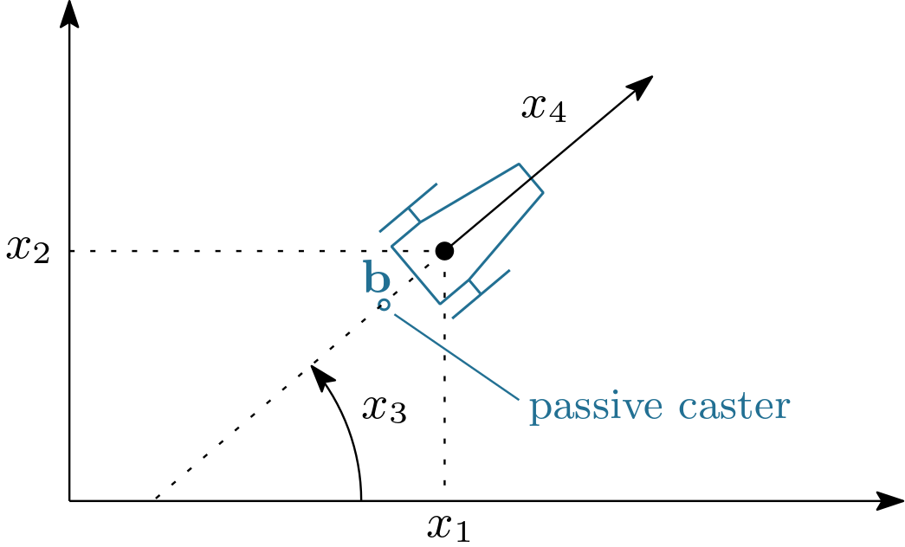

.. _sec-tuto-cprob-lesson-e:

Lesson E: Tile-based localization
=================================

  Main authors: `Simon Rohou <https://www.simon-rohou.fr/research/>`_, `Maël Godard <https://godardma.github.io>`_

This lesson addresses a state-estimation problem arising in indoor mobile robotics. A differential-drive robot evolves on a floor covered with square tiles of known width :math:`L`. Unlike range-based localization, we do not rely on external landmarks. Instead, the floor itself provides sparse exteroceptive information: each time the passive support caster crosses a grout line between two tiles, a shock appears in the accelerometer signal and can be detected after a simple filtering stage.

The platform considered here is a `TurtleBot Burger <https://emanual.robotis.com/docs/en/platform/turtlebot3/overview/>`_-like robot with two motorized wheels and one passive caster. Wheel odometers provide two signals :math:`u[0](\cdot)` and :math:`u[1](\cdot)`, from which the signed longitudinal speed can be reconstructed.
We assume that a heading sensor provides bounded measurements. Furthermore, the tile-crossing instants are already extracted from accelerometers data and provided in a ``txt`` file. The objective is to combine these data in order to re-estimate the robot position over time.

This problem is interesting for two reasons. First, the observations are sparse and **event-based**: the exteroceptive information is a list of time stamps, not a continuous signal. Second, each event is ambiguous: when a shock is detected, we do not know a priori whether the caster crossed a vertical grout line or a horizontal one, nor which line of the infinite grid was involved. Each observation therefore defines a union of feasible sets, which is a natural setting for interval analysis and contractor programming.

Formalism
---------

We denote by :math:`\mathbf{x}(t)\in\mathbb{R}^4` a state vector in which:

* :math:`(x_1,x_2)^\intercal` is the position of the axle midpoint in the plane;
* :math:`x_3` is the heading of the robot body;
* :math:`x_4` is the signed longitudinal speed.

The robot parameters are:

* :math:`R_1`: radius of each motorized wheel;
* :math:`R_2`: distance between the two motorized wheels;
* :math:`BL`: distance between the axle midpoint and the passive caster.

The wheel odometers provide two wheel-angle trajectories :math:`u[0](\cdot)` and :math:`u[1](\cdot)`. The usual differential-drive relations give

.. math::
  :label: eq-tile-odo

  x_4(t)=\frac{R_1}{2}\Big(\dot u[0](t)+\dot u[1](t)\Big),
  \qquad
  \dot x_3(t)=\frac{R_1}{R_2}\Big(\dot u[1](t)-\dot u[0](t)\Big).

In practice, the heading is measured directly and these measurements will be preferred to the one obtained by integrating :math:`\dot x_3`, in order to avoid drift. The planar kinematics of the axle midpoint is therefore modeled by

.. math::
  :label: eq-tile-f

  \dot x_1(t)=x_4(t)\cos\big(x_3(t)\big),
  \qquad
  \dot x_2(t)=x_4(t)\sin\big(x_3(t)\big).

The passive caster is located on the longitudinal axis of the robot, behind the axle in the robot frame. Its position in the world frame is thus

.. math::
  :label: eq-tile-caster

  \mathbf{b}(t)=
  \begin{pmatrix}
    b_1(t)\\
    b_2(t)
  \end{pmatrix}
  =
  \begin{pmatrix}
    x_1(t)\\
    x_2(t)
  \end{pmatrix}
  - BL
  \begin{pmatrix}
    \cos\big(x_3(t)\big)\\
    \sin\big(x_3(t)\big)
  \end{pmatrix}.

A useful practical remark is that the robot crosses tile joints more sharply when driving backward. In that case, the passive caster becomes the leading contact point with respect to the direction of motion, so the shock induced by a grout line is generally more pronounced and easier to detect. In this dataset, the integration is therefore performed with a reverse speed, i.e. :math:`x_4(t)` is mostly negative. This does not change the geometry of the robot: the caster is still given by Eq. :eq:`eq-tile-caster`, but it becomes the first element of the robot to meet the joint along the direction of motion.

The floor is modeled as an infinite square tiling of width :math:`L`. The set of grout lines is the union of vertical lines :math:`x=kL` and horizontal lines :math:`y=kL`, for all :math:`k\in\mathbb{Z}`. If :math:`t_i` is one of the extracted detection times, the caster position must satisfy

.. math::
  :label: eq-tile-obs-set

  b_1(t_i) \in L\mathbb{Z} + [-\varepsilon_L,\varepsilon_L]
  \quad \text{or} \quad
  b_2(t_i) \in L\mathbb{Z} + [-\varepsilon_L,\varepsilon_L],

where :math:`\varepsilon_L>0` accounts for tile and grout imperfections, as well as small geometric mismatches between the ideal square grid model and the actual floor.

The fact that the filtered shock is detected slightly after the physical crossing is treated separately at the temporal level: in practice, the contraction will be applied at a time slightly before :math:`t_i`.

A convenient implicit formulation uses the modulo operator:

.. math::
  :label: eq-tile-mod

  \operatorname{mod}\big(b_1(t_i),L\big)\in[-\varepsilon_L,\varepsilon_L]
  \quad \text{or} \quad
  \operatorname{mod}\big(b_2(t_i),L\big)\in[-\varepsilon_L,\varepsilon_L].

This is the observation model we will encode with a contractor.

  
  Overview of the experiment. The blue curve is the actual robot trajectory. The small markers indicate the detected tile-crossing events associated with the passive support wheel. As expected, these detections are distributed along the grout lines of the square tiling and provide sparse, event-based information that will be exploited for localization.

Robot notations
---------------

  Robot notations used in this lesson. :math:`(x_1,x_2)` is the axle-midpoint position, :math:`x_3` the heading, :math:`x_4` the longitudinal speed, :math:`R_1` the wheel radius, :math:`R_2` the distance between the two driving wheels, and :math:`BL` the distance between axle and passive caster. When :math:`x_4<0`, the robot moves backward and the caster becomes the leading contact point with respect to the direction of motion.

Provided data
-------------

The lesson uses three data files stored in the local directory ``./data``:

* :download:`Measured heading trajectory <./data/herdeudedac_tiles_pos.cdc>`
* :download:`Wheel-odometry trajectory <./data/herdeudedac_tiles_odo.cdc>`
* :download:`Detected tile-crossing instants <./data/herdeudedac_tiles_detections.txt>`

Files with extension ``.cdc`` are Codac binary data files, used to serialize and reload trajectories, tubes, and other Codac objects. See :ref:`how to serialize Codac objects <sec-tools-serialization>`.

Initialization and data loading
-------------------------------

.. admonition:: Exercise

  **E.0.** Update your current version of Codac. In Python, for instance:

  .. code-block:: bash

    pip install codac --upgrade --pre
    # Option --pre has to be set because Codac v2 is only available in pre-release

  To verify that you have the correct version, you can use:

  .. code-block:: bash

    python -m pip show codac

    > Name: codac
      Version: 2.0.0.dev28

  The required version for this tutorial is 2.0.0.dev28 or later.

The following instructions are given in Python, but feel free to use C++ or Matlab if you prefer.

.. admonition:: Exercise

  **E.1. Imports and data paths.**
  Start with the imports below. We explicitly import ``builtins`` because ``from codac import *`` shadows Python's ``min`` and ``max``.

  .. code-block:: python

    from codac import *
    import builtins as py
    import math

.. admonition:: Exercise

  **E.2. Loading sampled trajectories.**
  Load the binary ``.cdc`` files into sampled trajectories. We resample the wheel odometry on the same temporal support as ``pos``.

  .. code-block:: python

    # Loaded trajectories
    pos = SampledTraj_Vector()
    with open("./data/herdeudedac_tiles_pos.cdc", "rb") as f:
        deserialize(f, pos)
    u = SampledTraj_Vector()
    with open("./data/herdeudedac_tiles_odo.cdc", "rb") as f:
        deserialize(f, u)
    u = u.sampled_as(pos)

.. admonition:: Exercise

  **E.3. Reading detection times.**
  Write a helper function that reads the detection times from the text file:

  .. code-block:: python

    def tile_times(file):
        with open(file, "r", encoding="utf-8") as f:
            t = []
            for token in f:
                token = token.strip()
                if token:
                    t.append(float(token))
            return t

  **E.4. Drawing the map.**
  Write a function ``draw_map(X, L)`` that draws the infinite grid, clipped to a bounding box ``X``. As in the reference example, two tiles are highlighted in green.

  .. code-block:: python

    def draw_map(X, L):
        for d in range(2):
            kmin = py.min(0, math.floor(X[d].lb() / L) + 1)
            kmax = py.max(0, math.ceil(X[d].ub() / L) - 1)

            for k in range(kmin, kmax + 1):
                a = k * L
                if d == 0:
                    DefaultFigure.draw_line(
                        [[a, X[1].lb()], [a, X[1].ub()]],
                        Color.light_gray()
                    )
                else:
                    DefaultFigure.draw_line(
                        [[X[0].lb(), a], [X[0].ub(), a]],
                        Color.light_gray()
                    )

        for v in (Vector([0, 0]), Vector([-8, 8])):
            DefaultFigure.draw_box(
                IntervalVector(L * v) + IntervalVector([[0, L], [0, L]]),
                [Color.dark_green(), Color.green(0.1)]
            )

.. admonition:: Exercise

  **E.5. The tile-map contractor.**
  Build a contractor expressing that a 2D point lies close to **either** a vertical grout line **or** a horizontal grout line. In other words, your contractor must encode

  .. math::

    \operatorname{mod}(b_1,L)\in[-\varepsilon_L,\varepsilon_L]
    \quad \lor \quad
    \operatorname{mod}(b_2,L)\in[-\varepsilon_L,\varepsilon_L].

  You may introduce one analytic function for the first coordinate and one for the second one, as in the previous lessons, and then combine :ref:`the corresponding contractors <sec-ctc-analytic-ctcinverse>` with a union. A union of contractors is represented by the ``CtcUnion`` class, and can be called directly using the operator ``|``.

.. admonition:: Exercise

  **E.6. Verify that your tile-map contractor is correct, in a separate view.**
  Before using the contractor in the localization pipeline, it is a good idea to test it alone. In a separate view, pave a 2D search box with your contractor and verify visually that the feasible set is a family of thin horizontal and vertical strips spaced by :math:`L`.

  .. code-block:: python

    fig_ctcmap = Figure2D("Testing tile-map contractor", GraphicOutput.VIBES)
    fig_ctcmap.set_axes(axis(0,[-1,1]), axis(1,[-1,1])).auto_scale()
    fig_ctcmap.pave([[-1,1],[-1,1]], <your_contractor>, 1e-2)

  The grid must be centered at the origin: the grout lines are expected at :math:`x=kL` and :math:`y=kL`, so in particular one vertical strip and one horizontal strip must pass through :math:`(0,0)`.

  This is a very useful debugging step. If the paving does not look like a grid of strips, or if the grid is shifted and does not cross the origin, the contractor is not doing what it should.

Dead reckoning from recorded data
---------------------------------

We now reconstruct the motion information that will be used to initialize the position tube.
The recorded heading and wheel-odometry trajectories are loaded from the files in ``./data``.

.. admonition:: Exercise

  **E.7. Reconstruct the speed and heading trajectories.**
  Using Eq. :eq:`eq-tile-odo`, reconstruct the speed trajectory :math:`x_4(\cdot)` from the two odometers, and reconstruct a heading trajectory. In the code below, the odometric heading is first computed from :math:`\dot x_3(t)=\frac{R_1}{R_2}(\dot u[1](t)-\dot u[0](t))`, then replaced by the directly measured heading.

  Use the following robot parameters and initial condition:

  .. math::

    R_1 = 0.033,
    \qquad
    R_2 = 0.16,
    \qquad
    BL = 8\times 10^{-2},
    \qquad
    \mathbf{x}(0)=\left(\frac{L}{2},\frac{L}{2},0.018,0\right)^\intercal.

  .. code-block:: python

    L = 0.3
    L_eps = 1e-2

    R1 = 0.033
    R2 = 0.16
    BL = 8e-2
    x0 = Vector([L / 2, L / 2, 0.018, 0.0])

    traj_spd = R1 * (u[1].derivative() + u[0].derivative()) / 2
    traj_hdg = (R1 * (u[1].derivative() - u[0].derivative()) / R2).primitive() + x0[2]

    # Better: use the directly measured heading to avoid odometric drift.
    traj_hdg = continuous_traj(pos[2])

.. admonition:: Exercise

  **E.8. Create the heading and speed tubes.**
  We now enclose the measured heading and reconstructed speed by bounded tubes.
  The assumptions used in the reference script are:

  * heading uncertainty: :math:`\pm 2\times 10^{-3}` rad;
  * speed uncertainty: :math:`\pm 9\times 10^{-3}` m/s.

  These bounds are encoded by inflating the corresponding sampled trajectories after creating a temporal discretization.

  .. code-block:: python

    tdomain = create_tdomain(u.tdomain(), 5e-2)

    tube_hdg = SlicedTube(tdomain, traj_hdg)
    tube_hdg.inflate(2e-3)

    tube_spd = SlicedTube(tdomain, traj_spd)
    tube_spd.inflate(9e-3)

.. admonition:: Exercise

  **E.9. Compute the planar velocity tube.**
  Using Eq. :eq:`eq-tile-f`, define the analytic evolution function

  .. math::

    \mathbf{v}_{12}(t)=
    \begin{pmatrix}
      x_4(t)\cos\big(x_3(t)\big)\\
      x_4(t)\sin\big(x_3(t)\big)
    \end{pmatrix},

  and evaluate it over the heading and speed tubes.

  .. code-block:: python

    v_hdg = ScalarVar()
    v_spd = ScalarVar()
    f_evol = AnalyticFunction([v_hdg, v_spd], [
        v_spd * cos(v_hdg),
        v_spd * sin(v_hdg)
    ])

    tube_v12 = f_evol.tube_eval(tube_hdg, tube_spd)

.. admonition:: Exercise

  **E.10. Integrate an initial position tube.**
  Let :math:`[\mathbf{x}_{12}](\cdot)` denote the position tube.
  We initialize it from the initial position box

  .. math::

    [\mathbf{x}_{12}](0):=\left(x_1(0),x_2(0)\right)^\intercal + [-L/3,L/3]^2,

  then integrate the velocity tube.

  .. code-block:: python

    ix0 = IntervalVector(x0.subvector(0, 1))
    ix0.inflate(L / 3)

    tube_x12 = tube_v12.primitive(ix0)

.. admonition:: Exercise

  **E.11. Display the dead-reckoning enclosure.**
  Open a figure, draw the map, and display the dead-reckoning position tube. At this stage, no tile-crossing event has been used yet.

  .. code-block:: python

    X = IntervalVector([[-5, 2], [-2, 5]])
    DefaultFigure.set_window_properties([50, 50], [1000, 1000])
    DefaultFigure.set_axes(axis(0, X[0]), axis(1, X[1])).auto_scale()

    draw_map(X, L)
    DefaultFigure.draw_tube(tube_x12, [Color.light_gray(), Color.light_gray()])

Localization from tile-crossing events
--------------------------------------

We are now ready to inject the event-based observations into the position tube.
The derivative contractor will be used to propagate local contractions over time.

.. admonition:: Exercise

  **E.12. Prepare the contractors.**
  Instantiate the derivative contractor and your tile-map contractor.

  .. code-block:: python

    ctc_deriv = CtcDeriv()
    ctc_map = map_contractor(L, L_eps)

.. admonition:: Exercise

  **E.13. Contract the tile-crossing events and run a fixpoint loop.**
  At each detected instant :math:`t_i`, the shock extracted from the accelerometer is not expected to coincide exactly with the ideal geometric crossing time. The mechanical contact, the vibration propagation, the filtering, and the detection threshold may introduce a small delay. For this reason, the reference implementation evaluates the constraint at a slightly earlier instant

  .. math::

    t_j = t_i - 0.01.

  The idea is the following: just before the detected shock, the caster should already be very close to a grout line. Starting from the position box :math:`[\mathbf{x}_{12}](t_j)` and the heading interval :math:`[x_3](t_j)`, compute the corresponding caster box with Eq. :eq:`eq-tile-caster`, contract this box with your tile-map contractor, then project the contraction back onto the position box and propagate it through the whole tube with a derivative contractor inside a fixpoint loop.
  
  Implement this step yourself. The methodology is the same as in Lessons B, C and D: express each piece of available information as a contractor, apply these contractors repeatedly in a fixpoint loop, and let the contractions propagate through the tube until no significant improvement is obtained.

.. admonition:: Exercise

  **E.14. Display the final contracted tube.**
  Once the fixpoint loop has been implemented, display the contracted tube and overlay the grid.

  .. code-block:: python

    if not tube_x12.is_empty():
        DefaultFigure.draw_tube(tube_x12, ColorMap.blue_tube())
        draw_map(X,L) # drawing again the map over the tube

After solving the full localization problem, it is convenient to define a helper that draws a trajectory, the robot poses corresponding to the detected tile crossings, and the implied caster positions.

.. admonition:: Exercise

  **E.15. Draw the detections along a trajectory.**
  Define a helper ``draw_estim`` that, given a trajectory ``x`` and the detection times ``T``, draws the trajectory, a robot icon at each detection instant, and the corresponding caster point.

  .. code-block:: python

    def draw_estim(x, T, BL, traj_hdg, traj_col, detec_col):
        DefaultFigure.draw_trajectory(x, traj_col)

        for ti in T:
            pi = cart_prod(x(ti).subvector(0, 1), traj_hdg(ti))
            bi = Vector([
                pi[0] + BL * math.cos(pi[2] + PI),
                pi[1] + BL * math.sin(pi[2] + PI)
            ])

            DefaultFigure.draw_tank(pi.subvector(0, 2), 0.15, detec_col)
            DefaultFigure.draw_circle(bi, 5e-3, detec_col)

    draw_estim(tube_x12.mid(), T, BL, traj_hdg, Color.white(), Color.dark_blue())

  When the estimated tube has become sufficiently thin, the support wheel markers obtained from its midpoint trajectory should appear approximately on the tile grout lines.

.. admonition:: Exercise

  **E.16. Verify a double passage through a box.**
  We know from the experiment that the robot passes twice through the box

  .. math::

    [[-2.4,-2.1],[2.4,2.7]].

  Draw this box and check visually that the contracted position tube also passes through it twice.

  .. code-block:: python

    DefaultFigure.draw_box(
        IntervalVector([[-2.4, -2.1], [2.4, 2.7]]),
        [Color.white(), Color.blue(0.1)]
    )

Conclusion
----------

In this lesson, we used interval analysis and contractor programming to solve a localization problem based on sparse tile-crossing events. Unlike landmark-based localization, the available observations here are only time stamps, and each event is intrinsically ambiguous: it only tells us that the passive support wheel was close to either a vertical or a horizontal grout line of an infinite grid.

This example illustrates that even weak and ambiguous observations can significantly improve localization when they are modeled carefully and combined with the system dynamics. More broadly, it shows how contractor programming can exploit non-standard sensing modalities in a guaranteed set-membership framework.

A final remark is that this problem is not especially comfortable for standard Kalman filtering, because the tile-crossing observations are sparse, delayed, disjunctive, and naturally multimodal: each event only indicates proximity to either a vertical or a horizontal grout line of a periodic grid. Particle filters are in principle more suitable, since they can represent multi-hypothesis state distributions, but they may require a large number of particles to cope with the ambiguity and periodicity of the observations. By contrast, the interval-contractor approach used here is well matched to the set-valued nature of the problem: it handles ambiguity directly, preserves guarantees, and exploits the geometric structure of the tile map in a natural way.